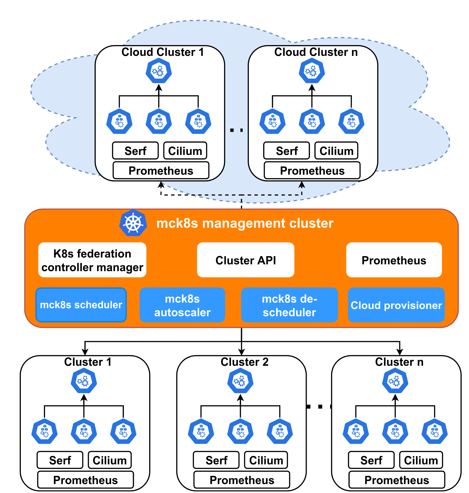
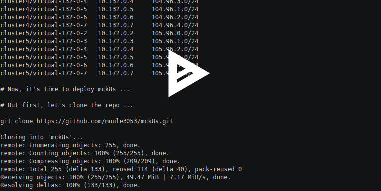

# mck8s: Container orchestrator for multi-cluster Kubernetes

mck8s, short for multi-cluster Kubernetes, allows you to automate the deployment of multi-cluster applications on multiple Kubernetes clusters by offering enhanced configuration possibilities. The main aim of mck8s is maximizing resource utilization and supporting elasitcity across multiple Kubenetes clusters by providing multiple placement policies, as well as bursting, cloud resource provisioning, autoscaling and de-provisioning capabilities. mck8s builds upon other open-source software such as [Kubernetes], [Kubernetes Federation], [kopf], [serf], [Cilium], [Cluster API], and [Prometheus].

This code is in active development and not stable, and thus not production ready.

All contributions are welcome :) 

# Architecture

The figure below shows the architecture of mck8s.

# Quick start

## Pre-requisites

- A Kubernetes cluster to act as the mck8s `management cluster` (named `cluster0`). Since mck8s components need access to the Kubernetes control plane, managed Kubernetes offerings such as GKE are not supported at the moment.
- Few Kubernetes clusters to be managed by the management cluster and on which workloads run. We call these `workload clusters` (named `cluster1`, `cluster2`, `cluster3`, ...). We assume that you have administrative access to all these clusters and the Kubernetes `kubeconfig` files of all clusters are available.
- If traffic routing between clusters is desired, it is recommended to deploy [Cilium Cluster Mesh] on the workload clusters with distinct Pod CIDRs.
- If proximity-aware placement is desired, [serf] should be deployed on at least one node of each workload cluster.
- If cloud provisioning and autoscaling ia desired, cloud credentials are required. For now, we support OpenStack clusters.

## Steps

### Prepare

1. Clone this repository to your computer.
2. Copy the `kubeconfig` file of the `management cluster` as `cluster0` in `~/.kube/` directory of your computer .
3. Copy the `kubeconfig` files from the `workload clusters` to `~/.kube/` directory of your computer and rename these files as per their cluster names such as `cluster1`, `cluster2`, or `cluster3`, .....
4. Make sure that the `cluster`, `context`, and `user` names is these files are distinct from each other.
5. Before running `prepare.sh`, which assumes that there are five `workload clusters`, `cluster1` to `cluster5`, edit the `values.yaml` file as per the number of your `workload clusters` and enter the IP addresses of the master nodes of your clusters.
6. Run the `prepare.sh` script, which sets up Kubernetes Federation, Prometheus Operator, and Cilium. This script assumes that there are five `workload clusters`, `cluster1` to `cluster5`. If you have a different number of `workload clusters`, please adjust the script accordingly.
7. Copy the `~/.kube/config` file to the `~/.kube/` directory of the `master node` of the `management cluster`.

### Deploy the CRDs on the management cluster

1. Switch to the `cluster0` context to be able to deploy the `CRDs` on the management cluster.
    
    `kubectl config use-context cluster0`

2. Create the `RBAC` required
    
    `kubectl apply -f manifests/crds/01_rbac_mck8s.yaml`
  
3. Deploy the `CRDs`
    
    `kubectl apply -f manifests/crds/`
    
### Buid Docker images of the controllers

1. Buid the image of the `Multi Cluster Scheduler`

    `cd multi-cluster-scheduler && docker build -t REPO_NAME/IMAGE_NAME .`
    
2. Build the image of the `Multi Cluster HPA`

    `cd multi-cluster-horizontal-pod-autoscaler && docker build -t REPO_NAME/IMAGE_NAME .`
    
3. Build the image of the `Cloud Provisioner and Cluster Autoscaler`

    `cd cloud-cluster-provisioner-autoscaler && docker build -t REPO_NAME/IMAGE_NAME .`
    
4. Build the image of the `Deployment Rescheduler`

    `cd multi-cluster-rescheduler && docker build -t REPO_NAME/IMAGE_NAME .`

### Deploy the controller Deployments on the `management cluster`

NOTE: The pods of these controllers are going to be scheduled on the master node of the `management cluster`. In the manifest files below, Replace the `MASTER_NODE_HOST_NAME`, `REPO_NAME/IMAGE_NAME`, and `/PATH/TO/HOME/DIRECTORY/` accordingly before running the following.

1. Deploy the `Multi Cluster Scheduler` Deployment

    `kubectl apply -f manifests/controllers/01_deployment_multi_cluster_scheduler.yaml`
    
2. Deploy the `Multi Cluster HPA` Deployment

    `kubectl apply -f manifests/controllers/02_deployment_multi_cluster_hpa.yaml`   
    
3. Deploy the `Cloud Provisioner and Cluster Autoscaler` Deployment

    `kubectl apply -f manifests/controllers/03_deployment_cloud_provisioner_cluster_autoscaler.yaml`
    
### Demo: Deployment of mck8s CRDs, controllers, multicluster scheduler, and example multicluster deployment

Let's see a demo of how to deploy the multiclusterscheduler, a sample multiclusterdeployment and a multiclusterservice.

### Demo: Inter-cluster traffic routing

In this demo, we show how to access a back-end application deployed on cluster3 via a front-end application deployed on cluster2.

# Related Publications

[1] Mulugeta Tamiru, Guillaume Pierre, Johan Tordsson, Erik Elmroth. mck8s: An orchestration platform for geo-distributed multi-cluster environments. ICCCN 2021 - 30th International Conference on Computer Communications and Networks, Jul 2021, Athens, Greece. pp.1-12. ([pdf](https://hal.inria.fr/hal-03205743/document))    
# Talks
[1] I gave a virtual talk titled "McK8s: Container Orchestration in Kubernetes Multi-Clusters" at KubeCon + CloudNativeCon NA 2021 https://www.youtube.com/watch?v=U1iHBZhEWUA&t=824s

[Kubernetes]: https://github.com/kubernetes/kubernetes
[Kubernetes Federation]: https://github.com/kubernetes-sigs/kubefed
[kopf]: https://github.com/nolar/kopf
[serf]: https://github.com/hashicorp/serf
[Cilium]: https://github.com/cilium/cilium
[Cluster API]: https://github.com/kubernetes-sigs/cluster-api
[Prometheus]: https://github.com/prometheus/prometheus
[Cilium Cluster Mesh]: https://docs.cilium.io/en/stable/gettingstarted/clustermesh/#deploying-a-simple-example-service
